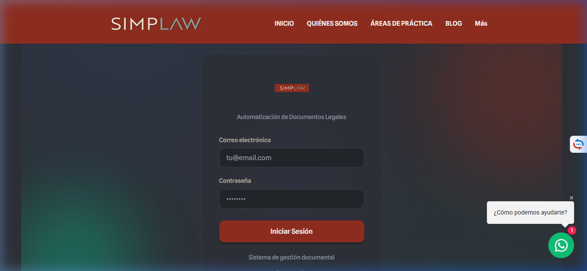
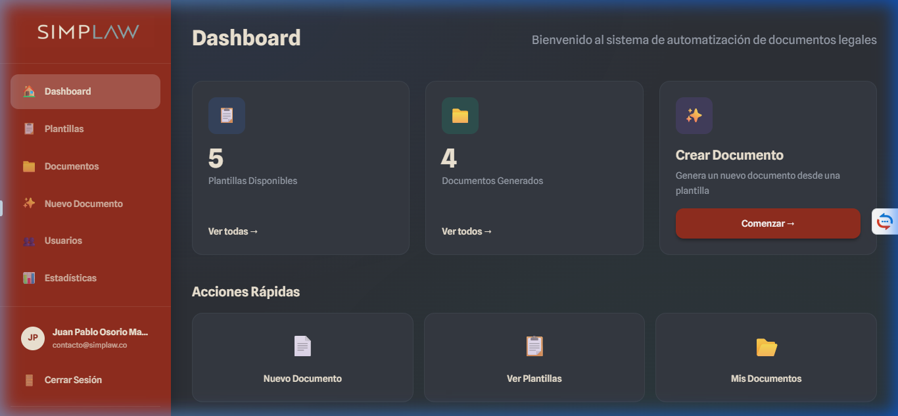
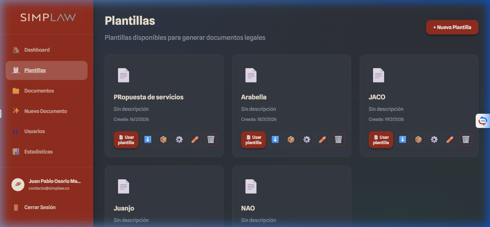
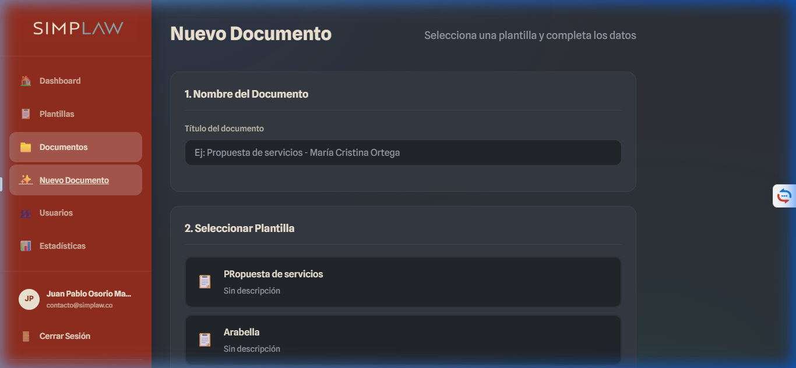
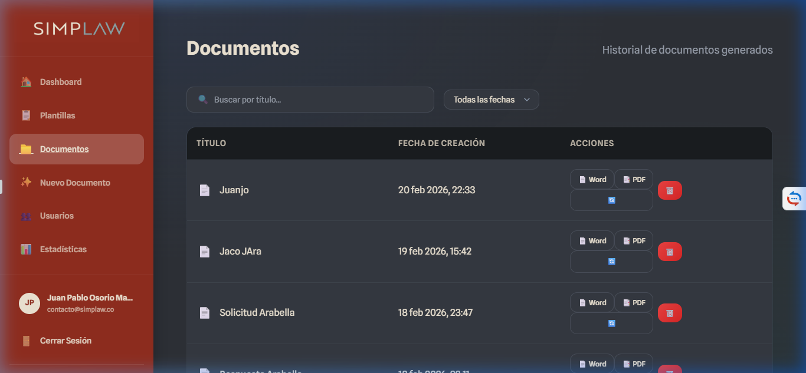
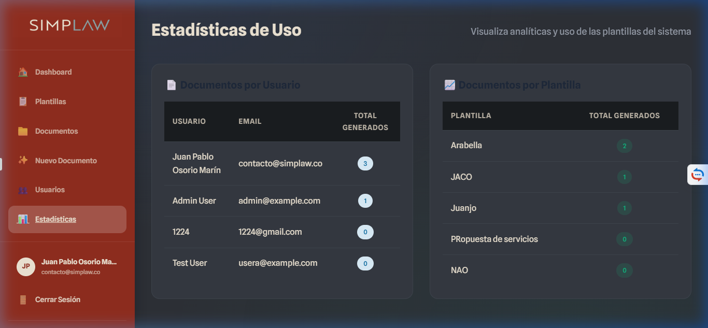

# Manual de Usuario - Automatización Documental (Simplaw)

Bienvenido al sistema de Automatización Documental. Este manual te guiará paso a paso por todas las funcionalidades de la plataforma, permitiéndote gestionar plantillas, generar documentos mediante inteligencia artificial y administrar usuarios y métricas de uso.

---

## 1. Inicio de Sesión
El acceso a la plataforma está restringido y requiere credenciales válidas. Si eres administrador o un usuario invitado, debes ingresar tu correo electrónico y contraseña.

<strong>Nota:</strong> Si olvidaste tu contraseña, contacta al administrador del sistema para que restablezca tu acceso desde el panel de Gestión de Usuarios.

## 2. Panel Principal (Dashboard)
Una vez inicias sesión, accederás al **Dashboard**. Esta pantalla te brinda un resumen instantáneo de tu actividad reciente.

Desde el menú lateral izquierdo podrás navegar rápidamente a las diferentes secciones:
* **Plantillas:** Administra tus archivos base (Word o PDF).
* **Documentos:** Consulta el historial de documentos generados.
* **Nuevo Documento:** El asistente para crear un archivo llenando un formulario.
* **Usuarios/Estadísticas:** (Solo Administradores) Control de acceso y uso.

## 3. Gestión de Plantillas
La sección de **Plantillas** es el corazón del sistema. Aquí subes los archivos Word (`.docx`) o PDF que se usarán como molde.

### ¿Cómo configurar una plantilla de Inteligencia Artificial?
1. Haz clic en **Nueva Plantilla** y sube tu archivo base.
2. Una vez subida, haz clic en el botón de configuración (⚙️).
3. En la pantalla de configuración, puedes añadir campos manualmente, o usar el botón **"Detectar Automáticamente"**.
4. **Instrucciones Personalizadas Petición IA:** Opcionalmente, puedes decirle a la IA cómo interpretar el documento (Ej. *"Extrae los nombres completos de las partes, e identifica si hay una tabla de honorarios que se llame 'servicios'"*).

## 4. Generación: Nuevo Documento
Para generar un contrato automatizado, ve a la sección **Nuevo Documento** y selecciona la plantilla que configuraste previamente.

### Llenado Dinámico y Listas (Ejemplo)
Si la plantilla requería una lista de elementos (por ejemplo, "Lista de Servicios" o "Inventario"), verás un botón para **+ Añadir Elemento**.
1. Haz clic en añadir.
2. Ingresa los datos individuales para cada fila (por ejemplo: `nombre` del servicio, `precio`, `cantidad`).
3. El sistema se encargará de organizar esta lista dinámicamente en el documento final, e incluso calculará precios totales automáticamente si configuraste la variable de suma.

*(Arriba: Lista de documentos generados donde puedes descargar la versión final).*

## 5. Panel de Administración y Estadísticas
Si tu cuenta tiene previlegios de *Superusuario*, verás un botón adicional en el menú lateral llamado **Usuarios** y **Estadísticas**.

### Estadísticas de Uso
Para entender cómo se está utilizando la herramienta, la sección de **Estadísticas** agrupa automáticamente el número de documentos creados. Esto te permite facturar a tus clientes por volumen o simplemente auditar las plantillas más exitosas:
* **Generados por Usuario:** ¿Quién está utilizando más el software?
* **Generados por Plantilla:** ¿Cuál es el contrato más recurrente?

<strong>Tip Administrativo:</strong> Puedes usar este panel para restringir acceso rápidamente ingresando a "Usuarios" y desactivando el interruptor de estado (🛑) de cualquier empleado o cliente.

