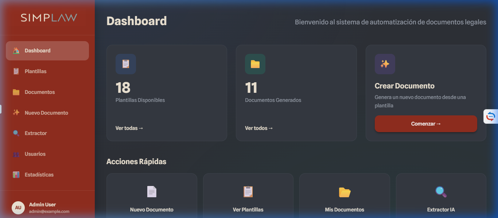
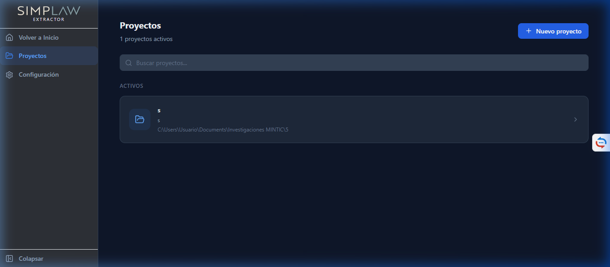
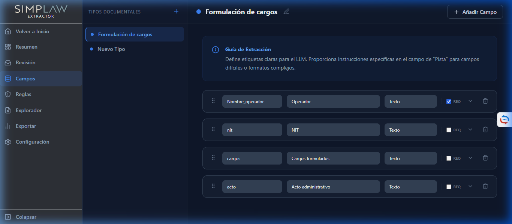
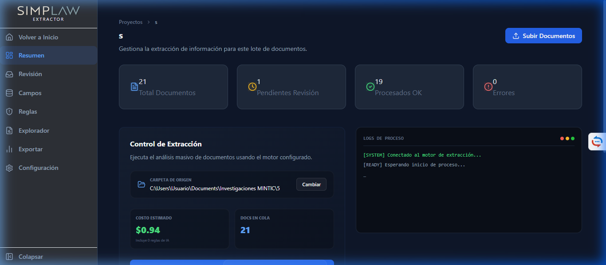
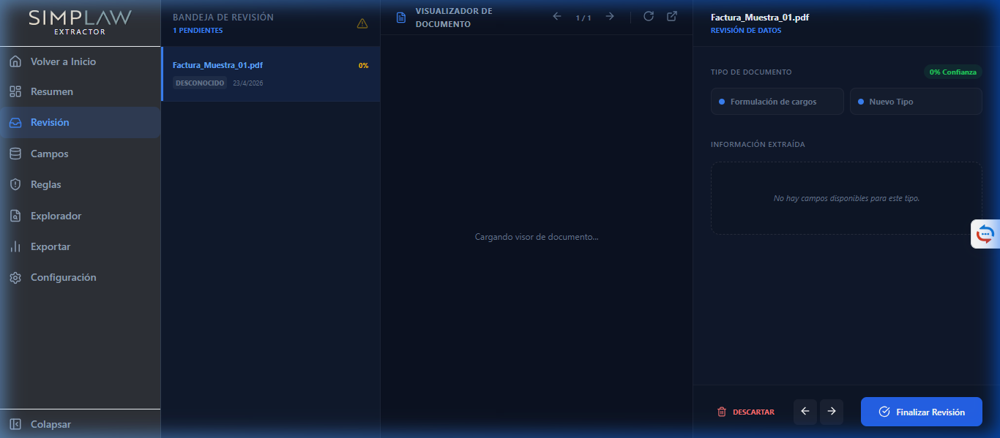
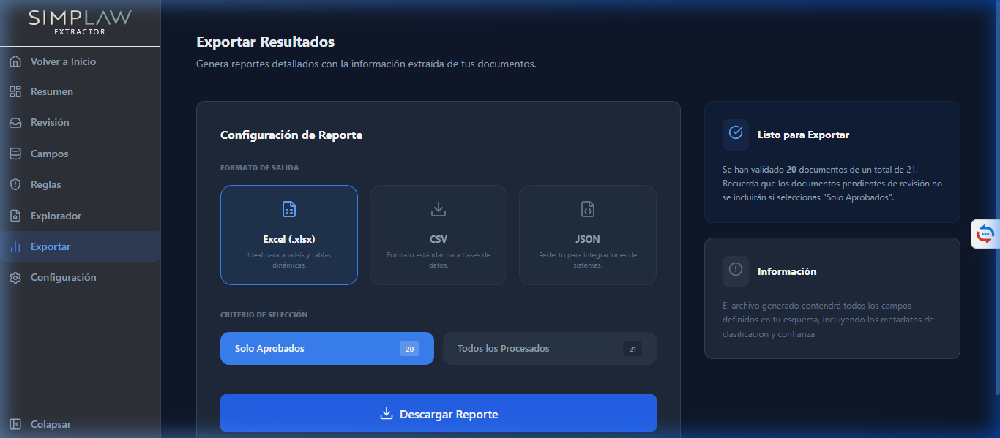

# Manual de Usuario - Automatización Documental (Simplaw)

Bienvenido al sistema de Automatización Documental (SIMPLAW). Este manual te guiará paso a paso por las dos grandes potencias de la plataforma: la **Automatización de Plantillas** y el **Extractor de Datos con IA**, permitiéndote optimizar tu flujo de trabajo legal de manera integral.

---

## 1. Inicio de Sesión
El acceso a la plataforma está restringido y requiere credenciales válidas. Si eres administrador o un usuario invitado, debes ingresar tu correo electrónico y contraseña.

<strong>Nota:</strong> Si olvidaste tu contraseña, contacta al administrador del sistema para que restablezca tu acceso desde el panel de Gestión de Usuarios.

## 2. Panel Principal (Dashboard)
Una vez inicias sesión, accederás al **Dashboard**. Esta pantalla te brinda un resumen instantáneo de tu actividad reciente.

Desde el menú lateral izquierdo podrás navegar rápidamente a las diferentes secciones:
* **Plantillas:** Administra tus archivos base (Word o PDF).
* **Documentos:** Consulta el historial de documentos generados.
* **Extractor:** Accede al módulo de procesamiento masivo de documentos con IA.
* **Nuevo Documento:** El asistente para crear un archivo llenando un formulario.

## 3. Gestión de Plantillas
La sección de **Plantillas** es el corazón del sistema. Aquí subes los archivos Word (`.docx`) o PDF que se usarán como molde.

### ¿Cómo configurar una plantilla de Inteligencia Artificial?

### Preparación del Documento Word (Sintaxis de Variables)
Antes de subir tu plantilla, debes insertar las variables dentro del archivo Word (`.docx`). Simplaw identifica tres tipos de variables principales basados en cómo las escribes:

#### 1. Variables Simples
Son datos únicos que cambiarán en cada documento generado. Se envuelven entre llaves dobles.
* **Sintaxis:** `{{nombre_variable}}`
* **Ejemplo:** El contrato se firma en la ciudad de `{{ciudad_firma}}`, a nombre de `{{nombre_cliente}}`.

#### 2. Elementos Numerados (Listas o Grupos Dinámicos)
Se utilizan para recolectar listas o tablas donde el usuario podrá añadir múltiples elementos del mismo tipo (ej. "Servicios" o "Pagos"). Para que el sistema lo convierta en un grupo dinámico, debes usar una estructura con número:
* **Sintaxis:** `{{grupo_N_campo}}` o simplemente `{{grupo_N}}`
* **Ejemplo en una tabla de pagos:**
  * Fila 1: `{{pago_1_monto}}` - `{{pago_1_fecha}}`
  * Fila 2: `{{pago_2_monto}}` - `{{pago_2_fecha}}`
* *Nota:* En la pantalla de generación, el sistema unirá estos campos bajo el grupo "Pagos" permitiendo al usuario final añadir un número indefinido de filas usando el botón **+ Añadir Elemento**.

#### 3. Variables Condicionadas (Párrafos Opcionales)
A veces, hay párrafos o cláusulas enteras de un documento que solo quieres incluir si ocurre una situación específica (por ejemplo, quieres que una "Cláusula de Mascotas" solo aparezca si el cliente dice que sí tiene mascotas, y si no, que desaparezca sin dejar un hueco en blanco).

Para lograr esto, debes decirle al sistema dónde **inicia** y dónde **termina** el texto opcional. 

* **El "truco":** Debes "envolver" o "encerrar" tu texto en Word usando estos comandos:
  1. Al inicio del texto, escribe: `` (puedes cambiar 'incluir_mascotas' por el nombre que quieras, usando siempre guiones bajos en vez de espacios).
  2. Al final del texto, escribe: ``.

**📝 Ejemplo paso a paso en tu documento de Word:**

> ****
> **Cláusula Sexta - Mascotas:** El arrendatario está autorizado para tener hasta un límite de dos mascotas dentro del inmueble. El daño que las mascotas ocasionen deberá ser reparado por su cuenta.
> ****

**¿Qué pasará cuando generes el documento en la plataforma?**
El sistema te preguntará en la pantalla: *"¿LLevar mascotas?"*. 
* Si respondes **SÍ**: El documento final mostrará la Cláusula Sexta normalmente y borrará los "códigos" `{%p if...}`.
* Si respondes **NO**: Toda la Cláusula Sexta desaparecerá mágicamente y los demás párrafos se ajustarán hacia arriba, por lo que **no quedará ningún espacio en blanco**.

💡 *Nota para no técnicos:* Si todo esto te parece muy complicado, ¡No te preocupes! Puedes subir tu documento normal de Word sin poner estos códigos. Luego, ya dentro de la plataforma, usa el botón de **"Configurar Lógica (IA)"**: la Inteligencia Artificial los detectará y los insertará de forma casi automática por ti.

### Pasos para configurar la plantilla en el sistema:
1. Haz clic en **Nueva Plantilla** y sube tu archivo base.
2. Una vez subida, haz clic en el botón de configuración (⚙️).
3. En la pantalla de configuración, puedes añadir campos manualmente, o usar el botón **"Detectar Automáticamente"**.
4. **Instrucciones Personalizadas Petición IA:** Opcionalmente, puedes decirle a la IA cómo interpretar el documento (Ej. *"Extrae los nombres completos de las partes, e identifica si hay una tabla de honorarios que se llame 'servicios'"*).

## 4. Generación: Nuevo Documento
Para generar un contrato automatizado, ve a la sección **Nuevo Documento** y selecciona la plantilla que configuraste previamente.

### Llenado Dinámico y Listas (Ejemplo)
Si la plantilla requería una lista de elementos (por ejemplo, "Lista de Servicios" o "Inventario"), verás un botón para **+ Añadir Elemento**.
1. Haz clic en añadir.
2. Ingresa los datos individuales para cada fila (por ejemplo: `nombre` del servicio, `precio`, `cantidad`).
3. El sistema se encargará de organizar esta lista dinámicamente en el documento final, e incluso calculará precios totales automáticamente si configuraste la variable de suma.

*(Arriba: Lista de documentos generados donde puedes descargar la versión final).*

## 5. Extractor de Datos (IA)
El **Extractor** es un módulo avanzado que permite procesar grandes volúmenes de documentos (PDF o Word) para extraer información estructurada automáticamente mediante Inteligencia Artificial.

### Flujo de Trabajo del Extractor

#### 1. Gestión de Proyectos
Todo comienza con un **Proyecto**. Un proyecto agrupa documentos del mismo tipo o cliente. En la pantalla inicial del extractor verás tus proyectos activos.

#### 2. Definición del Esquema (Campos a Extraer)
Antes de subir documentos, debes definir **qué** quieres extraer. En la sección **Campos**, puedes crear una lista de etiquetas (ej. "Fecha del Contrato", "Nombre del Vendedor", "Valor Total").
* La IA utilizará estas etiquetas para buscar la información específica en cada página del documento.

#### 3. Carga y Procesamiento
Una vez configurado el esquema, sube tus archivos en la sección principal del proyecto. El sistema comenzará el procesamiento automáticamente:
1. **OCR:** Lectura de texto (incluso en PDF escaneados).
2. **Análisis IA:** Identificación de los campos definidos en el esquema.
3. **Resumen:** Generación de un resumen ejecutivo del documento.

#### 4. Bandeja de Revisión y Aprobación
La Inteligencia Artificial es una gran ayuda, pero la validación humana es clave. En la **Bandeja de Revisión**, podrás ver el resultado de cada documento:
* Si el dato es correcto, haz clic en **Aprobar**.
* Si el dato necesita un ajuste, puedes editarlo directamente en la tabla.
* Una vez aprobado, el documento se marca como "Completado".

#### 5. Exportación de Resultados
Cuando hayas procesado y aprobado tus documentos, ve a la sección **Exportar**. Aquí podrás descargar un archivo **Excel** consolidado con toda la información extraída de todos los documentos del proyecto. 

<strong>Tip:</strong> El extractor es ideal para procesos de Due Diligence, auditorías de contratos masivos o digitalización de expedientes antiguos.

## 6. Perfil y Preferencias
Puedes acceder a tu perfil desde la parte superior derecha (clic en tu nombre/avatar). Aquí podrás:
* Cambiar tu contraseña.
* Actualizar tu información de contacto.
* Cerrar sesión de forma segura.
